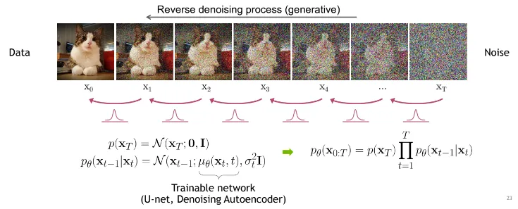

# 探究多种ML方法在MNIST数据集上的分类和生成

## 1 摘要
本实验报告旨在探究多种ML方法在手写数字数据集（MNIST）上的分类识别和生成的效果。报告主要分为两个部分，第一部分作者探究了分别使用Random Forest、SVM、MLP和CNN四种机器学习（深度学习）方法在MNIST数据集上对手写数字进行分类识别的实现与评估。第二部分中，作者基于Diffusion模型中的Ho等人提出的**DDPM**方法[[1]](https://arxiv.org/abs/2006.11239)，使用Peebles等人于2022年提出的**DiT**[[2]](https://arxiv.org/abs/2212.09748)作为骨干网络，借助MNIST数据集训练了一个Conditional Diffusion模型，实现可以通过输入数字来生成对应的手写数字。

## 2 MNIST数据集介绍

MNIST是一个手写体数字的图片数据集，该数据集来由美国国家标准与技术研究所（National Institute of Standards and Technology (NIST)）发起整理，一共统计了来自250个不同的人手写数字图片，其中50%是高中生，50%来自人口普查局的工作人员。该数据集的收集目的是希望通过算法，实现对手写数字的识别。(本段介绍参考CSDN文章：[Mnist数据集简介](https://blog.csdn.net/tony_vip/article/details/118735261))

图片来自维基百科：


## 3 MNIST手写数字数据集分类识别

本节中，作者使用Random Forest, SVM, MLP和CNN四种方法对手写数字数据集进行分类识别，其中Random Forest和SVM方法使用`skit-learn`库进行实现，而MLP和CNN方法则使用Meta的`PyTorch`框架进行构造实现。

### 3.1 MNIST数字识别-SVM实现

在本小节中，作者使用使用`sklearn`库中的`datasets`模块直接读取内置在工具包中的MNIST数据集，然后进行8:2的训练集-测试集划分。通过`SVM`模型拟合labels，最终在测试集上借助`metrics`模块中的`classification_report`和混淆矩阵`confusion_matrix`评估结果，同时可视化了部分测试的结果。

从结果中可以看出SVM方法在随机划分的测试集上取得了**94%** 的准确率。


```python
from sklearn import datasets, svm, metrics
from sklearn.model_selection import train_test_split
import matplotlib.pyplot as plt

digits = datasets.load_digits()

X = digits.images
y = digits.target

n_samples = len(X)
X = X.reshape((n_samples, -1))

X_train, X_test, y_train, y_test = train_test_split(X, y, test_size=0.2, shuffle=False)


svm_model = svm.SVC()
svm_model.fit(X_train, y_train)

svm_predicted = svm_model.predict(X_test)

#-----------------------验证阶段(直接写成函数方便后面RF复用)-----------------------#
def test_report(predicted, visual=True):
    print("Classification Report:")
    print(metrics.classification_report(y_test, predicted))

    print("Confusion Matrix:")
    print(metrics.confusion_matrix(y_test, predicted))
    
    if visual:
        _, axes = plt.subplots(nrows=1, ncols=4, figsize=(10, 3), dpi=160)
        for ax, image, prediction in zip(axes, X_test, predicted):
            ax.set_axis_off()
            image = image.reshape(8, 8)
            ax.imshow(image, cmap=plt.cm.gray_r, interpolation='nearest')
            ax.set_title(f'Prediction: {prediction}')

        plt.show()

test_report(svm_predicted)
```

    Classification Report:
                  precision    recall  f1-score   support
    
               0       1.00      0.97      0.99        35
               1       0.97      1.00      0.99        36
               2       1.00      1.00      1.00        35
               3       0.96      0.73      0.83        37
               4       0.97      0.92      0.94        37
               5       0.93      1.00      0.96        37
               6       1.00      1.00      1.00        37
               7       0.92      0.97      0.95        36
               8       0.78      0.94      0.85        33
               9       0.92      0.89      0.90        37
    
        accuracy                           0.94       360
       macro avg       0.94      0.94      0.94       360
    weighted avg       0.95      0.94      0.94       360
    
    Confusion Matrix:
    [[34  0  0  0  1  0  0  0  0  0]
     [ 0 36  0  0  0  0  0  0  0  0]
     [ 0  0 35  0  0  0  0  0  0  0]
     [ 0  0  0 27  0  2  0  2  6  0]
     [ 0  0  0  0 34  0  0  0  1  2]
     [ 0  0  0  0  0 37  0  0  0  0]
     [ 0  0  0  0  0  0 37  0  0  0]
     [ 0  0  0  0  0  0  0 35  1  0]
     [ 0  1  0  0  0  0  0  0 31  1]
     [ 0  0  0  1  0  1  0  1  1 33]]


    

    


### 3.2 MNIST数字识别-Random Forest实现

本小节中，作者更换骨干模型，使用随机森林作为分类器，数据和验证部分则复用上面SVM部分写好的代码。为了使报告简洁，作者在这一小节不再可视化最终的预测结果。

经过测试发现，Random Forest在该数据集上的测试准确率为**92%** ，不如SVM方法。


```python
from sklearn.ensemble import RandomForestClassifier as RFC

rfc_model = RFC()
rfc_model.fit(X_train, y_train)

rfc_predicted = rfc_model.predict(X_test)

test_report(rfc_predicted, visual=False)
```

    Classification Report:
                  precision    recall  f1-score   support
    
               0       0.97      0.97      0.97        35
               1       0.94      0.89      0.91        36
               2       1.00      0.97      0.99        35
               3       0.96      0.73      0.83        37
               4       0.92      0.92      0.92        37
               5       0.86      0.97      0.91        37
               6       1.00      0.97      0.99        37
               7       0.86      1.00      0.92        36
               8       0.85      0.85      0.85        33
               9       0.87      0.92      0.89        37
    
        accuracy                           0.92       360
       macro avg       0.92      0.92      0.92       360
    weighted avg       0.92      0.92      0.92       360
    
    Confusion Matrix:
    [[34  0  0  0  1  0  0  0  0  0]
     [ 0 32  0  0  0  0  0  0  0  4]
     [ 1  0 34  0  0  0  0  0  0  0]
     [ 0  0  0 27  0  3  0  2  5  0]
     [ 0  0  0  0 34  0  0  3  0  0]
     [ 0  0  0  0  1 36  0  0  0  0]
     [ 0  1  0  0  0  0 36  0  0  0]
     [ 0  0  0  0  0  0  0 36  0  0]
     [ 0  1  0  0  1  1  0  1 28  1]
     [ 0  0  0  1  0  2  0  0  0 34]]


### 3.3 MNIST数字识别-MLP实现

在本小节中，作者使用多层感知机(MLP)来学习MNIST数据集上的手写数字识别。算法模型实现使用Meta开发的深度学习框架`PyTorch`，数据集选择torch自带的MNIST数据集，在进行归一化处理后转换为tensor输入给构建的MLP模型。作者同样将train和test部分集成为函数，方便下一小节中的CNN进行复用。

在MLP模型构建中，作者构建了一个三层MLP网络，其每层的size分别为：$[784, 128, 64, 10]$，每两个线性层之间使用$\text{ReLU}(x) = \max(0, x)$作为激活函数进行非线性化，同时加入了参数为0.05的正则化(Dropout)。损失函数选择内置了softmax的交叉熵损失函数`nn.CrossEntropyLoss()`，优化器选择为随机梯度下降(Stochastic Gradient Descent)`optim.SGD()`，学习率设置为0.01，并且进行了batch size为64的批量化分，累积所有批次的损失，然后统一进行小批量梯度下降更新参数。

训练使用[AutoDL服务器平台](https://www.autodl.com/)的NVIDIA RTX 3090显卡进行加速（CNN同样）。

在10个epoch的训练后，最终在测试集上取得了**96.77%** 的准确率，相比SVM和RF，提升较大。


```python
import torch
import torch.nn as nn
import torch.optim as optim
from torchvision import datasets, transforms
from torch.utils.data import DataLoader

batch_size = 64
device = 'cuda:0'

transform = transforms.Compose([
    transforms.ToTensor(),
    transforms.Normalize((0.5,), (0.5,))
])

train_dataset = datasets.MNIST(root='../MINST_data/data', train=True, download=True, transform=transform)
test_dataset = datasets.MNIST(root='../MINST_data/data', train=False, download=True, transform=transform)

train_loader = DataLoader(dataset=train_dataset, batch_size=batch_size, shuffle=True)
test_loader = DataLoader(dataset=test_dataset, batch_size=batch_size, shuffle=False)


def train_model(model):
    model.train()
    for epoch in range(epochs):
        for images, labels in train_loader:
            images = images.view(-1, 28*28).to(device)
            labels = labels.to(device)

            outputs = model(images)
            loss = criterion(outputs, labels)

            optimizer.zero_grad()
            loss.backward()
            optimizer.step()

        print(f'Epoch [{epoch+1}/{epochs}], Loss: {loss.item():.4f}')

def test_model(model):
    model.eval()
    with torch.no_grad():
        correct = 0
        total = 0
        for images, labels in test_loader:
            images = images.view(-1, 28*28).to(device)
            labels = labels.to(device)
            outputs = model(images)
            _, predicted = torch.max(outputs.data, 1)
            total += labels.size(0)
            correct += (predicted == labels).sum().item()

    print(f'Accuracy of the model on the test images: {100 * correct / total:.2f}%')
```


```python
class MLP(nn.Module):
    def __init__(self,input_size, hidden_sizes, output_size, dropout=0.05):
        super(MLP, self).__init__()
        self.layers = nn.Sequential(
            nn.Linear(input_size, hidden_sizes[0]),
            nn.ReLU(),
            nn.Linear(hidden_sizes[0], hidden_sizes[1]),
            nn.Dropout(dropout),
            nn.ReLU(),
            nn.Linear(hidden_sizes[1], output_size)
        )

    def forward(self, x):
        return self.layers(x)

input_size = 784
hidden_sizes = [128, 64]
output_size = 10
batch_size = 64
learning_rate = 0.01
epochs = 20

mlp_model = MLP(input_size=input_size,
               hidden_sizes=hidden_sizes,
               output_size=output_size).to(device)
criterion = nn.CrossEntropyLoss()
optimizer = optim.SGD(mlp_model.parameters(), lr=learning_rate)

train_model(mlp_model)
test_model(mlp_model)
```

    Epoch [1/20], Loss: 0.3099
    Epoch [2/20], Loss: 0.3154
    Epoch [3/20], Loss: 0.2290
    Epoch [4/20], Loss: 0.1616
    Epoch [5/20], Loss: 0.2464
    Epoch [6/20], Loss: 0.3810
    Epoch [7/20], Loss: 0.1645
    Epoch [8/20], Loss: 0.1605
    Epoch [9/20], Loss: 0.4279
    Epoch [10/20], Loss: 0.0898
    Epoch [11/20], Loss: 0.0459
    Epoch [12/20], Loss: 0.1424
    Epoch [13/20], Loss: 0.0492
    Epoch [14/20], Loss: 0.1140
    Epoch [15/20], Loss: 0.0997
    Epoch [16/20], Loss: 0.1085
    Epoch [17/20], Loss: 0.0438
    Epoch [18/20], Loss: 0.0232
    Epoch [19/20], Loss: 0.3076
    Epoch [20/20], Loss: 0.0610
    Accuracy of the model on the test images: 96.77%


### 3.4 MNIST数字识别-CNN实现

在本节中，作者使用在CV领域中常用的深度学习方法卷积神经网络(Convolutional Neural Network, CNN)来进行手写数字数据集的识别分类。CNN中最为重要的就是卷积层，卷积层由可学习的卷积核组成，主要意义在于可以通过可学习的方式来自动实现对图片的特征提取，从而取代了传统机器学习研究中由领域专家进行人工手动特征工程的操作。1998年，Yan LeCun 等人发表了论文“Gradient-Based Learning Applied to Document Recognition”[[3]](https://ieeexplore.ieee.org/document/726791)，首次提出了基于卷积操作的LeNet-5网络，让人们得知了CNN网络的强大，而他们实验的数据集也正是MNIST。

在本篇报告中，作者不再具体阐述CNN的具体工作原理，在GitHub仓库下，作者已将之前在其他课程作业中完成的**卷积神经网络结构与应用介绍**存放在`doc/卷积神经网络结构与应用介绍.pdf`中[<打开>](doc/卷积神经网络结构与应用介绍.pdf)，其中还介绍了作者使用PyTorch基于ResNet101迁移学习的情绪图片识别的项目案例。

多通道卷积操作动图来自[Animated AI](https://animatedai.github.io/):


在具体实现中，作者使用两层卷积核shape为$5 \times 5$的卷积层，填充(Padding)为2，步长(Stride)为1，中间使用最大池化层(Max Pooling)，然后经过一个两个线性层输出结果。优化方面依旧选择交叉熵损失函数，SGD优化器，学习率为0.01，复用train和test函数。

同样在训练了20个epoch后，最终在测试集上得到了**98.86%** 的准确率，远超RF、SVM和MLP三个算法，可见CNN模型的强大。


```python
device = 'cuda:0'

class CNN(nn.Module):
    def __init__(self):
        super(CNN, self).__init__()
        self.conv_layer = nn.Sequential(
            nn.Conv2d(1, 32, kernel_size=5, stride=1, padding=2),
            nn.ReLU(),
            nn.MaxPool2d(kernel_size=2, stride=2), 
            nn.Conv2d(32, 64, kernel_size=5, stride=1, padding=2),
            nn.ReLU(),
            nn.MaxPool2d(kernel_size=2, stride=2)
        )
        self.fc_layer = nn.Sequential(
            nn.Linear(64 * 7 * 7, 1000),
            nn.ReLU(),
            nn.Dropout(0.05),
            nn.Linear(1000, 10)
        )

    def forward(self, x):
        x = self.conv_layer(x)
        x = x.view(x.size(0), -1) 
        x = self.fc_layer(x)
        return x

cnn_model = CNN().to(device)
criterion = nn.CrossEntropyLoss()
optimizer = optim.SGD(cnn_model.parameters(), lr=0.01)

def train_model(model):
    model.train()
    for epoch in range(20):
        for images, labels in train_loader:
            images = images.to(device)
            labels = labels.to(device)

            outputs = model(images)
            loss = criterion(outputs, labels)

            optimizer.zero_grad()
            loss.backward()
            optimizer.step()

        print(f'Epoch [{epoch+1}/20], Loss: {loss.item():.4f}')

def test_model(model):
    model.eval()
    with torch.no_grad():
        correct = 0
        total = 0
        for images, labels in test_loader:
            images = images.to(device)
            labels = labels.to(device)
            outputs = model(images)
            _, predicted = torch.max(outputs.data, 1)
            total += labels.size(0)
            correct += (predicted == labels).sum().item()

    print(f'Accuracy of the model on the test images: {100 * correct / total:.2f}%')

train_model(cnn_model)
test_model(cnn_model)
```

    Epoch [1/20], Loss: 0.1095
    Epoch [2/20], Loss: 0.0918
    Epoch [3/20], Loss: 0.0300
    Epoch [4/20], Loss: 0.0579
    Epoch [5/20], Loss: 0.0217
    Epoch [6/20], Loss: 0.0075
    Epoch [7/20], Loss: 0.0304
    Epoch [8/20], Loss: 0.0088
    Epoch [9/20], Loss: 0.0478
    Epoch [10/20], Loss: 0.0094
    Epoch [11/20], Loss: 0.0045
    Epoch [12/20], Loss: 0.0122
    Epoch [13/20], Loss: 0.0040
    Epoch [14/20], Loss: 0.0476
    Epoch [15/20], Loss: 0.1753
    Epoch [16/20], Loss: 0.0298
    Epoch [17/20], Loss: 0.0034
    Epoch [18/20], Loss: 0.0101
    Epoch [19/20], Loss: 0.0418
    Epoch [20/20], Loss: 0.0367
    Accuracy of the model on the test images: 98.86%


## 4 MNIST手写数字数据集图像生成

在本节中，作者将基于Diffusion模型构建一个可以根据输入label生成对应手写数字的图片的生成模型。和原本图像生成领域SOTA的GAN相比，DDPM拟合的是加噪图片，并通过反向过程（去噪）生成原始图片。Diffusion模型的原理类似给图片去噪，通过学习给一张图片去噪的过程来理解有意义的图像是如何生成，因此扩散模型生成的图片相比GAN模型精度更高，更符合人类视觉和审美逻辑，同时随着样本数量和深度学习时长的累积，扩散模型展现出对艺术表达风格较好的模仿能力。下图展示了四种主流生成模型GAN, VAE, Flow和Diffusion在模型结构上的不同之处[[来自:URL]](https://medium.com/@gitau_am/a-friendly-introduction-to-denoising-diffusion-probabilistic-models-cc76b8abef25)。


如今的Diffusion模型的相关研究与应用例如爆火的Midjourney, Stable Diffusion和DALL·E等都基于Ho等人于2020年的发布的文章中提到的DDPM方法[[1]](https://arxiv.org/abs/2006.11239)。DDPM包括两个过程：前向过程（Forward process）和反向过程（Reverse process），其中前向过程又称为扩散过程（Diffusion process）。无论是前向过程还是反向过程都是一个参数化的马尔可夫链（Markov chain），其中反向过程可以用来生成图片。

在2022年之前，人们都使用基于CNN的U-Net模型作为应用在Diffusion过程中预测噪声的骨干网络。然而，Peebles等人于2022年提出的**DiT**[[2]](https://arxiv.org/abs/2212.09748)这是一种基于ViT[[4]](https://arxiv.org/abs/2010.11929)的Transformer[[5]](https://arxiv.org/abs/1706.03762)类型模型。这个模型展示出更先进地计算性能，在图片的还原精度例如FID等指标上超过了U-Nets类型的网络模型，也成为了如今爆火的OpenAI Sora的骨干网络之一。

在本节作者将介绍并复现DiT模型，并且使用MNIST数据集对其进行训练，最终实现入下图[[来自:URL]](https://medium.com/@gitau_am/a-friendly-introduction-to-denoising-diffusion-probabilistic-models-cc76b8abef25)的根据输入数字从完全噪声图片来生成手写数字的效果。


### 4.1 DDPM

DDPM(Diffusion Denoising Probability Models)自Ho等人于2020年的发布的文章"Denoising Diffusion Probabilistic Models"[[1]](https://arxiv.org/abs/2006.11239)提出后便在图像生成领域被广泛应用。DDPM通过模拟一个数据从初始状态逐渐添加噪声转化为完全随机噪声状态的过程，然后再逆向这一过程来逐步恢复出原始数据。在正向过程中，模型逐步地将噪声加入到数据中，每一步都会让数据状态更接近一个标准高斯分布；在逆向过程中，模型则尝试从这个噪声状态重构出无噪声的初始数据，每一步都基于当前的噪声数据和一个神经网络的预测来逆向推断出前一状态的数据，这个神经网络专门用于估算去除噪声后的数据状态。这一系列逆向步骤最终能够生成与原始数据相似的高质量样本。下图形象地展示了正向扩散与逆向重构的过程[[来自:URL]](https://medium.com/@gitau_am/a-friendly-introduction-to-denoising-diffusion-probabilistic-models-cc76b8abef25)。



在数学上，DDPM涉及到一个初始数据分布$ p(\mathbf{x}_0) $，通过一系列扩散步骤慢慢转变为一个已知的高斯分布$ p(\mathbf{x}_T) $。这个过程可以表达为一个马尔可夫链，其中每一步都增加一些噪声：

$$
\mathbf{x}_{t} = \sqrt{1-\beta_t} \mathbf{x}_{t-1} + \sqrt{\beta_t} \mathbf{\epsilon}, \quad \mathbf{\epsilon} \sim \mathcal{N}(0, \mathbf{I})
$$

其中，$ \beta_t $是一个预设的噪声级别，控制着噪声的加入程度。在扩散过程完成后，通过逆向去噪步骤，模型试图恢复出初始数据$ \mathbf{x}_0 $。这一逆过程涉及到对条件概率$ p(\mathbf{x}_{t-1}|\mathbf{x}_t) $的建模：

$$
\mathbf{x}_{t-1} = \frac{1}{\sqrt{1-\beta_t}}\left(\mathbf{x}_t - \frac{\beta_t}{\sqrt{1-\beta_t}}\boldsymbol{\mu}_\theta(\mathbf{x}_t, t)\right) + \sigma_t \mathbf{z}, \quad \mathbf{z} \sim \mathcal{N}(0, \mathbf{I})
$$

此处，$ \boldsymbol{\mu}_\theta(\mathbf{x}_t, t) $ 是一个由神经网络参数化的函数，用于预测去除噪声后的数据。$ \sigma_t $ 是噪声的标准差，通常是依赖于时间步$ t $的函数。

通过这种方式，DDPM不仅可以生成新的数据样本，还可以在生成过程中逐步提升数据的质量，从而生成非常接近真实数据的样本。

### 4.2 DiT

DiT模型提出自Peebles等人于2022年发表的文章"Scalable Diffusion Models with Transformers"[[2]](https://arxiv.org/abs/2212.09748)。作者在文章中提出原本的U-Net模型其基于CNN的归纳偏置(局部性和平移不变性)在Diffusion生成过程中是不被需要的，因此该文章的主要贡献就是提出了一种完全抛弃CNN结构，完全依赖于Transormer中attention架构类似于ViT模型的Diffusion骨干网络DiT来实现对噪声$\epsilon(X_{t},t)$的预测。作者在文章中尝试了三种不同的DiT Block结构（如下图[[2]](https://arxiv.org/abs/2212.09748)），经过实验，最终选择了利用Perez等人[[6]](https://arxiv.org/abs/1709.07871)提出的Adaptive Layer Norm(adaLN) 来实现信息聚合。


#### 4.2.1 Noised Latent& Patchify

在DiT中，论文作者首先使用与Latent Diffusion[[7]](https://arxiv.org/abs/2112.10752)相同的VAE模型将图片映射到$R^{256 \times 256 \times 3}$的Latent Space实现图片压缩。然后，作者利用和ViT[[4]](https://arxiv.org/abs/2010.11929)类似的方法对图片进行切分并转换为token形式，并添加上与ViT和Transformer相同的基于sin-cos的绝对位置编码。其中，patch size($p$)是一个超参数，文章中提出了$p=2,4,8$三种选择。下图展示了patching的过程[[来自URL]](https://www.analyticsvidhya.com/blog/2021/03/an-image-is-worth-16x16-words-transformers-for-image-recognition-at-scale-vision-transformers/)。


#### 4.2.2 DiT block design

在DiT中，论文作者尝试三种不同的block架构(如上图)来实现对加噪图片的噪声预测，以及对time step和conditional label的信息融合。
- **In-context conditioning:** 在这种方法中，论文作者简单将经过embedding的time step和label信息拼接在图片patch tokens的末尾，类似于ViT中的$[CLS]$ token。这种方法的模型计算复杂度(每秒浮点计算次数: Gflops)微乎其微，但是生成效果(弗雷歇特初始距离: FID)最差，落选。
- **Cross-attention block:** 在这种方法中，论文作者尝试利用Transformer Decoder中的cross-attention来融合信息，这种方法也常见于一些U-Net架构的Diffusion模型中。但是这种方法对于Gflops的提升较大，因此也落选。
- **Adaptive layer norm (adaLN) block& adaLN-zero block:** 这个方法始见于Perez等人的文章"FiLM: Visual Reasoning with a General Conditioning Layer"[[6]](https://arxiv.org/abs/1709.07871)，其原本的作用是为了更好的融合文本与图片的信息来实现图片理解(Visual Reasoning)任务。而后这种信息融合方法也被图像生成模型所利用，例如StyleGAN[[8]](https://arxiv.org/abs/1812.04948)，并加入了归一化(Normalization) 将其命名为adaLN。其工作原理就是构建2个MLP来分别预测$\beta, \gamma$，然后进行$\text{adaLN}(x)=\text{LayerNorm}(\gamma x + \beta)$计算。在DiT中，论文作者使用全零初始化提升性能，并且额外又增加了一个scale操作，即多预测一个$\alpha$。最终，论文作者选择了这种方式来构建DiT block。

#### 4.2.3 Transformer Decoder

在N个DiT block的计算后，论文作者通过一个简单的线性层来将encoding后的信息还原回每个patch的具体像素值，然后再通过VAE的decoder将隐空间信息还原回图片，最终实现了惊人的效果。

### 4.3 最终实现

在本节中，作者将复现DiT的代码，并且实现使用MNIST数据集对其进行训练已达到可以根据输入的数字label来生成对应的手写数字。然而由于代码中包含的模块过多，不适合在notebook中展示，因此只在此处展示训练、测试和验证的效果，具体代码可在作者GitHub仓库中查看，复现代码参考自[[owenliang GitHub]](https://github.com/owenliang/mnist-dits/tree/main)。


```python
import torch 
from torch import nn 
from torch.utils.data import DataLoader
import dit_diffusion.config as config
from dit_diffusion.dataset import MNIST
from dit_diffusion.diffusion import forward_add_noise
from dit_diffusion.dit import DiT
from dit_diffusion.train import train_model
```

初始化数据集、模型、损失函数和优化器，其中模型超参数细节可以查看`dit_diffusion/config.py`文件，此处不再赘述：


```python
dataset = MNIST()
model = DiT(img_size=config.IMG_SIZE, 
            patch_size=config.PATCH_SIZE,
            channel=config.CHANNEL,
            emb_size=config.EMB_SIZE,
            label_num=config.LABEL_NUM,
            dit_num=config.DIT_NUM,
            head=config.HEAD).to(config.DEVICE)

loss_fn = nn.L1Loss()
optimizer = torch.optim.Adam(model.parameters(), lr=1e-3)
dataloader = DataLoader(dataset, batch_size=config.BATCH_SIZE, shuffle=True, num_workers=10, persistent_workers=True)
```

进行epoch为500的训练，学习率为0.001，每50个epoch输出一次结果，最后绘制一张loss随epoch变化的图像。训练的环境是使用[AutoDL服务器平台](https://www.autodl.com/)的NVIDIA RTX 3090显卡进行加速。


```python
train_model(model, dataloader, 500, loss_fn, optimizer)
```


      0%|          | 0/500 [00:00<?, ?it/s]


    epoch:0 iter:0, loss:0.9289978742599487
    epoch:50 iter:10000, loss:0.06262084096670151
    epoch:100 iter:20000, loss:0.04798031598329544
    epoch:150 iter:30000, loss:0.048515547066926956
    epoch:200 iter:40000, loss:0.046585697680711746
    epoch:250 iter:50000, loss:0.0471629872918129
    epoch:300 iter:60000, loss:0.042707521468400955
    epoch:350 iter:70000, loss:0.04543275386095047
    epoch:400 iter:80000, loss:0.04372534528374672
    epoch:450 iter:90000, loss:0.04383612424135208


    

    


下面进行推理过程，展示生成效果。


```python
from dit_diffusion.inference import inference

inference(model_path='model.pth')
```


    

    


## 5 References

[1] Ho, J., Jain, A., & Abbeel, P. (2020). Denoising Diffusion Probabilistic Models. ArXiv, abs/2006.11239.</br>
[2] Peebles, W.S., & Xie, S. (2022). Scalable Diffusion Models with Transformers. 2023 IEEE/CVF International Conference on Computer Vision (ICCV), 4172-4182.</br>
[3] Y. Lecun, L. Bottou, Y. Bengio and P. Haffner, "Gradient-based learning applied to document recognition," in Proceedings of the IEEE, vol. 86, no. 11, pp. 2278-2324, Nov. 1998, doi: 10.1109/5.726791.</br>
[4] Dosovitskiy, A., Beyer, L., Kolesnikov, A., Weissenborn, D., Zhai, X., Unterthiner, T., Dehghani, M., Minderer, M., Heigold, G., Gelly, S., Uszkoreit, J., & Houlsby, N. (2020). An Image is Worth 16x16 Words: Transformers for Image Recognition at Scale. ArXiv, abs/2010.11929.</br>
[5] Vaswani, A., Shazeer, N.M., Parmar, N., Uszkoreit, J., Jones, L., Gomez, A.N., Kaiser, L., & Polosukhin, I. (2017). Attention is All you Need. Neural Information Processing Systems.</br>
[6] Perez, E., Strub, F., Vries, H.D., Dumoulin, V., & Courville, A.C. (2017). FiLM: Visual Reasoning with a General Conditioning Layer. AAAI Conference on Artificial Intelligence.</br>
[7] Rombach, R., Blattmann, A., Lorenz, D., Esser, P., & Ommer, B. (2021). High-Resolution Image Synthesis with Latent Diffusion Models. 2022 IEEE/CVF Conference on Computer Vision and Pattern Recognition (CVPR), 10674-10685.</br>
[8] Karras, T., Laine, S., & Aila, T. (2018). A Style-Based Generator Architecture for Generative Adversarial Networks. 2019 IEEE/CVF Conference on Computer Vision and Pattern Recognition (CVPR), 4396-4405.


```python

```
